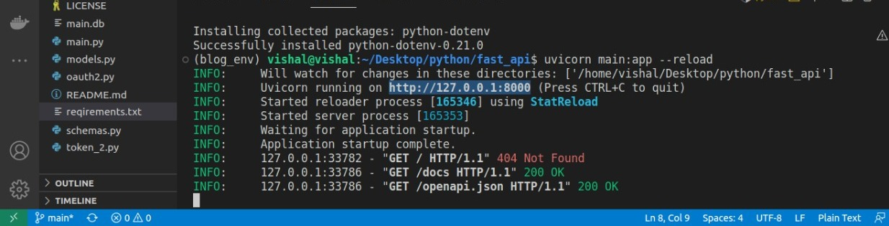

# Blog Management System
## Project Description

In this project, we have created a Blog management system. In this project, multiple users can create several blogs. And our management system will keep track of all the blogs, along with their creator in a database(sqlite3 table). We used SQLAlchemy ORM to interact with the database (table), make our work a bit easier, and avoid writing complicated SQL commands.

## Motive of Project

The main aim of this project is to create a system. Which can keep the track of a blog and the creator of that blog.

## What does this project do?

Blog management systems allow a user to write a blog. That Blog gets saved into the **Blogs_table** table. With the help of sqlalchemy. SQLalchemy ORM helps us to manipulate data from databases using an object-oriented paradigm. Without writing the actual SQL queries. 

## Technologies used
In this project, we have used some of the best technologies present in the market. Some of these technologies are given below:-  
1. FastAPI
1. uvicorn 
1. sqlalchemy
1. passlib
1. bcrypt
1. python-jose  

These are some important technologies. Which must be present in your system to run this project.

## How to Run this project?

For running this project you must have some modules and technologies present in your system. We have provided a list of required modules and technologies, which are necessary for this project to run on your system, you can find it in the requirements.txt file. I will tell you later how to download all the modules/Technologies by a single line of command. But before that follow the following commands step by step:- 
1) clone this repository in your repository    
> git clone https://github.com/sanjeet1999/Blog-  management-system.git 
this command will help you in cloning. 
2)  Now you need to download all the required modules/Technologies. Just run the below command in your command line.
> pip install -r requirements.txt
And this command will fulfill the all necessity of this project, which your system demands.
3) Now you need a server to respond to your requests for that reason we have uvicorn. Which have already been installed in our system.  So run this command on your terminal.
> uvicorn main:app --reload 

4) In this above picture you can see you will get a link to the local host where our webpage gets hosted. ***ctrl+left_click_mouse*** will take you to their. 

5) you can edit the URL from http://127.0.0.1:8000/ to http://127.0.0.1:8000/docs. And it will redirect you to the Swagger UI. where you can see all your routes and endpoints. In batter graphics

